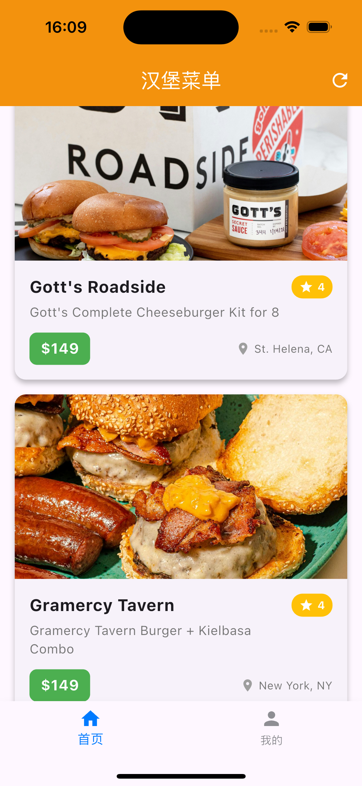

# Flutter Demo 项目知识点总结

## 1. 项目概述

这是一个基于Flutter框架开发的移动应用示例，主要展示了登录页面和主页面的实现。项目采用了模块化的结构设计，使用了多种Flutter组件和自定义Widget，实现了一个具有现代UI设计的应用界面。

## 2. 项目结构

```
├── lib/
│   ├── constants/         # 常量定义
│   │   ├── app_colors.dart    # 颜色常量
│   │   ├── app_icons.dart     # 图标路径常量
│   │   └── app_strings.dart   # 文本常量
│   ├── models/           # 数据模型
│   │   └── tab_item.dart      # 底部导航栏项模型
│   ├── pages/            # 页面
│   │   ├── home/             # 首页相关
│   │   │   └── home_page.dart
│   │   ├── login/            # 登录相关
│   │   │   ├── login_page.dart
│   │   │   └── widgets/      # 登录页面组件
│   │   ├── profile/          # 个人中心相关
│   │   │   └── profile_page.dart
│   │   └── main_tab_page.dart # 主标签页面
│   └── main.dart         # 应用入口
└── assets/              # 资源文件
    └── icons/           # 图标资源
```

## 3. 核心功能实现

### 3.1 登录页面 (LoginPage)

登录页面是一个StatefulWidget，包含以下核心功能：

- **表单验证**：使用GlobalKey<FormState>进行表单验证
- **输入控制**：使用TextEditingController管理输入字段
- **状态管理**：跟踪密码可见性和加载状态
- **异步操作**：模拟异步登录请求
- **页面导航**：成功登录后导航到主页面

```dart
// 处理登录逻辑
Future<void> _handleLogin() async {
  // 验证表单是否有效
  if (_formKey.currentState!.validate()) {
    // 显示加载指示器
    setState(() {
      _isLoading = true;
    });

    // 模拟一个耗时的登录请求
    await Future.delayed(const Duration(seconds: 2));

    // 隐藏加载指示器
    setState(() {
      _isLoading = false;
    });

    // 如果组件仍然挂载，则导航到主页
    if (mounted) {
      Navigator.pushReplacement(
        context,
        MaterialPageRoute(builder: (context) => const MainTabPage()),
      );
    }
  }
}
```

### 3.2 自定义组件

项目中使用了多个自定义组件，提高了代码的可复用性和可维护性：

#### 3.2.1 EmailField

自定义邮箱输入字段，包含验证逻辑：

```dart
validator: (value) {
  // 验证邮箱是否为空
  if (value == null || value.isEmpty) {
    return '请输入邮箱地址';
  }
  // 使用正则表达式验证邮箱格式
  if (!RegExp(r'^[^\s@]+@[^\s@]+\.[^\s@]+$').hasMatch(value)) {
    return '请输入有效的邮箱地址';
  }
  return null;
},
```

#### 3.2.2 PasswordField

自定义密码输入字段，支持切换密码可见性：

```dart
PasswordField(
  controller: _passwordController,
  isPasswordVisible: _isPasswordVisible,
  onVisibilityChanged: () {
    setState(() {
      _isPasswordVisible = !_isPasswordVisible;
    });
  },
),
```

#### 3.2.3 LoginButton

自定义登录按钮，支持加载状态显示：

```dart
LoginButton(
  isLoading: _isLoading,
  onTap: () => _handleLogin(),
),
```

#### 3.2.4 CustomMessage

自定义消息提示组件，支持多种消息类型（成功、信息、警告、错误）：

```dart
MessageUtils.showInfo(
  context,
  title: '功能开发中',
  message: '$provider 登录功能正在开发中，敬请期待',
);
```

### 3.3 主页面导航 (MainTabPage)

主页面使用底部导航栏实现页面切换：

- 使用IndexedStack保持页面状态
- 使用BottomNavigationBar实现底部导航
- 使用SVG图标显示活跃和非活跃状态

```dart
bottomNavigationBar: BottomNavigationBar(
  currentIndex: _currentIndex,
  onTap: (index) {
    setState(() {
      _currentIndex = index;
    });
  },
  items: _tabs.map((tab) {
    return BottomNavigationBarItem(
      icon: SvgPicture.asset(tab.icon, width: 24, height: 24, color: AppColors.tabInactive),
      activeIcon: SvgPicture.asset(tab.activeIcon, width: 24, height: 24, color: AppColors.tabActive),
      label: tab.title,
    );
  }).toList(),
  // 其他配置...
),
```

## 4. 设计模式与最佳实践

### 4.1 组件化设计

项目采用了高度组件化的设计，将UI元素拆分为可复用的小组件，如：
- LoginHeader
- EmailField
- PasswordField
- LoginButton
- ForgotPasswordButton
- DividerWithText
- SocialLoginSection

### 4.2 常量抽离

将颜色、文本和图标路径等常量抽离到单独的文件中：
- AppColors：定义应用中使用的颜色
- AppStrings：定义应用中使用的文本
- AppIcons：定义应用中使用的图标路径

### 4.3 模型定义

使用模型类定义数据结构，如TabItem：

```dart
class TabItem {
  final String title;
  final String icon;
  final String activeIcon;

  const TabItem({
    required this.title,
    required this.icon,
    required this.activeIcon,
  });
}
```

### 4.4 异步处理

使用async/await处理异步操作，并正确管理组件的生命周期：

```dart
if (mounted) {
  Navigator.pushReplacement(
    context,
    MaterialPageRoute(builder: (context) => const MainTabPage()),
  );
}
```

## 5. UI设计特点

### 5.1 深色主题

登录页面采用深色主题设计，背景为黑色，输入框为深灰色，形成鲜明对比。

### 5.2 渐变按钮

登录按钮使用绿色渐变效果，增强视觉吸引力：

```dart
decoration: BoxDecoration(
  gradient: const LinearGradient(
    colors: [Color(0xFF32D74B), Color(0xFF28C940)],
    begin: Alignment.topLeft,
    end: Alignment.bottomRight,
  ),
  borderRadius: BorderRadius.circular(12),
),
```

### 5.3 自适应布局

使用Flex布局和相对尺寸，确保在不同屏幕尺寸上的适配性。

### 5.4 交互反馈

- 加载状态显示：使用CircularProgressIndicator
- 表单验证反馈：显示错误信息
- 自定义消息提示：使用CustomMessage组件

## 6. Dio网络请求库使用

项目中使用了Dio作为HTTP客户端，主要特点包括：

1. **基础配置**：
   - 支持GET/POST/PUT/DELETE等HTTP方法
   - 支持请求/响应拦截器
   - 支持文件上传/下载
   - 支持请求取消

2. **示例代码**（来自home_page.dart）：
```dart
// 发起GET请求到汉堡API
final response = await http.get(
  Uri.parse('https://free-food-menus-api-two.vercel.app/burgers'),
  headers: {'Content-Type': 'application/json'},
);

// 处理响应
if (response.statusCode == 200) {
  List<dynamic> burgers = jsonDecode(response.body);
  // 更新UI状态
  setState(() {
    _burgers = burgers;
    _isLoading = false;
  });
} else {
  // 处理错误
  setState(() {
    _isLoading = false;
    _errorMessage = '请求失败：状态码 ${response.statusCode}';
  });
}
```

3. **最佳实践**：
   - 封装网络请求层，避免业务代码直接调用Dio
   - 统一错误处理
   - 使用拦截器实现日志打印、认证等通用功能

## 7. 总结



本项目展示了Flutter应用开发的多个核心概念和最佳实践，包括：

1. **组件化开发**：将UI拆分为可复用的组件
2. **状态管理**：使用StatefulWidget管理组件状态
3. **表单处理**：实现表单验证和提交
4. **导航管理**：实现页面间的导航
5. **自定义组件**：创建符合设计需求的自定义组件
6. **异步操作**：处理网络请求等异步操作
7. **UI设计**：实现现代化的用户界面

通过这些实践，项目实现了一个功能完整、UI美观的登录流程和主页面导航。
