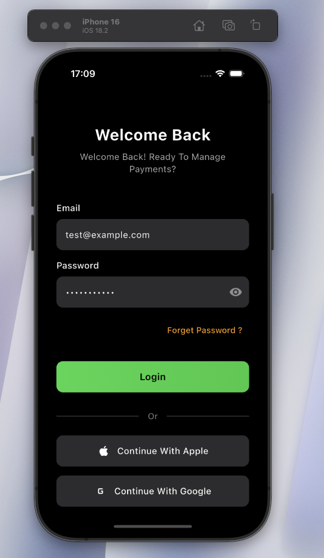
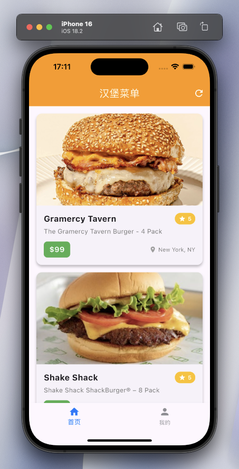

# Flutter Demo 项目知识点总结

## 1. 项目概述

这是一个基于Flutter框架开发的移动应用示例，主要展示了登录页面和主页面的实现。项目采用了模块化的结构设计，使用了多种Flutter组件和自定义Widget，实现了一个具有现代UI设计的应用界面。

## 2. 项目结构

```
├── lib/
│   ├── constants/         # 常量定义
│   │   ├── app_colors.dart    # 颜色常量
│   │   ├── app_icons.dart     # 图标路径常量
│   │   └── app_strings.dart   # 文本常量
│   ├── models/           # 数据模型
│   │   └── tab_item.dart      # 底部导航栏项模型
│   ├── pages/            # 页面
│   │   ├── home/             # 首页相关
│   │   │   └── home_page.dart
│   │   ├── login/            # 登录相关
│   │   │   ├── login_page.dart
│   │   │   └── widgets/      # 登录页面组件
│   │   ├── profile/          # 个人中心相关
│   │   │   └── profile_page.dart
│   │   └── main_tab_page.dart # 主标签页面
│   └── main.dart         # 应用入口
└── assets/              # 资源文件
    └── icons/           # 图标资源
```

## 3. 核心功能实现

### 3.1 登录页面 (LoginPage)

登录页面是一个StatefulWidget，包含以下核心功能：

- **表单验证**：使用GlobalKey<FormState>进行表单验证
- **输入控制**：使用TextEditingController管理输入字段
- **状态管理**：跟踪密码可见性和加载状态
- **异步操作**：模拟异步登录请求
- **页面导航**：成功登录后导航到主页面


